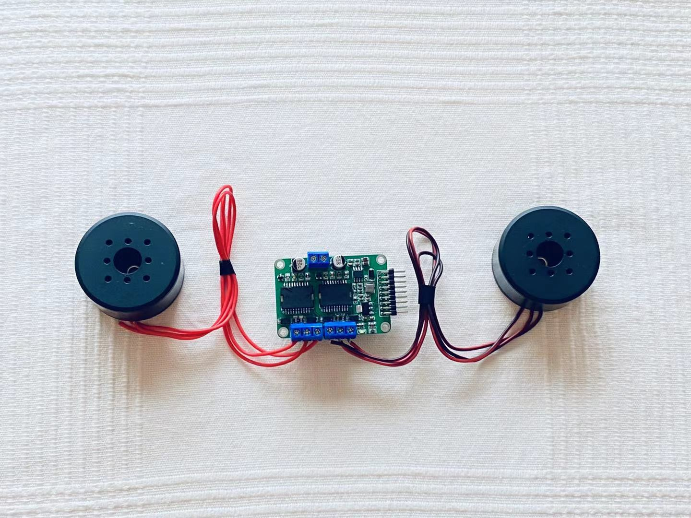

# 灯哥开源FOC双路无刷电机控制器

​      灯哥开源 FOC 控制器是一个由灯哥开源的，基于Apache 2.0 开源协议和ESP32主控的低成本无刷电机双路FOC驱动控制板。双路总功率 240W，单路最大功率 120W，支持绝大部分的云台电机FOC 位置、速度、力矩开闭环控制。编码器方面支持常见IIC和ABI、PWM制式。**加入在线电流检测模块，实现真正完整的FOC控制**。总的来说， 灯哥开源 FOC 控制器是一个好用又便宜的双路无刷FOC驱动器，点击查看 [效果视频](https://www.bilibili.com/video/BV1Hz4y127FL/)。

​     灯哥开源无刷FOC目前的发展受到灯哥开源团队的深度支持，目前已经针对这块控制板开发出了[灯哥开源无刷四足机器人](https://github.com/ToanTech/py-apple-bldc-quadruped-robot)，DIY视频和效果见：[B站](https://www.bilibili.com/video/BV1kV411i76z/)，后续还有无刷平衡车，倒立摆等等运行示例推出，敬请关注。

* **目前该主控板已经上架淘宝，是焊接好调试好的成品，出售即包括 ESP32** ；有需要大家可以猛击[淘宝链接](https://item.taobao.com/item.htm?spm=a230r.1.14.9.34c9688aRXg2O6&id=638363654504&ns=1&abbucket=20#detail)

* 开源工作不易，希望大家多点 Star ,视频多一键三联！！！

## 1 软件特性（支持 SimpleFOC库 2.1.1）

  作为国内最早引入 SimpleFOC 的团队，我们一直在致力深度改进 SimpleFOC硬件使其本土化，让大家能够以低廉的价格玩动无刷FOC算法。SimpleFOC是一个支持强大的开源库，可以实现无刷电机开闭环力矩、速度、位置控制，具体特性如下：

- **基于 Arduino**：运行在 ESP32 Arduino 上

- **开源**: 所有代码和配置文档都可以在：[SimpleFOC文档页](https://docs.simplefoc.com/) 找到

- **轻量化**：相比 Odrive 等驱动器，更加轻量化的软件结构可以帮你高速完成算法学习及配置

- **控制模式丰富**：开/闭环 速度、位置；以及开环的基于力矩控制；两种FOC内核算法

- **图形化配置软件**:最新的 DengFOC 对应支持使用 **SimpleFOC Studio** 进行电机参数配置，如下图所示，配置方法请见 文档PDF

  

## 2 硬件特性

| 说明             | 参数                                                      |
| ---------------- | --------------------------------------------------------- |
| 尺寸             | 56*39 mm                                                  |
| 输入电压类型     | 直流DC                                                    |
| 输入电压         | 12-24V                                                    |
| 最大功率         | 单路120W 双路共240W                                       |
| 支持电机数       | 2                                                         |
| 主控             | 底面搭载ESP32开发板 lolin32 lite                          |
| 编码器支持       | IIC方式、ABI方式、PWM方式编码器(AS5600、AS5047、AS5048等) |
| 拓展接口         | 串口（可以通过串口对FOC板子进行控制）                     |
| 电流检测参考电压 | 3.3V                                                      |
| 电流检测最大电流 | 3.3A                                                      |

## 3 社区

本FOC板子社区为一Q群，欢迎加入：**开源FOC无刷驱动交流群 灯哥开源 群号 778255240**

任何使用问题和 DIY 问题 都会在这里做直接的讨论解答

## 4 项目文件说明

* Dengs FOC V3.0 DIY资料：BOM、原理图、PCB、Gerber
* Dengs FOC V3.0 测试例程：14个灯哥开源FOC开环、闭环、应用方面的测试视频
* 灯哥开源 FOC 使用文档 PDF：**配置的详细方式和使用教程**